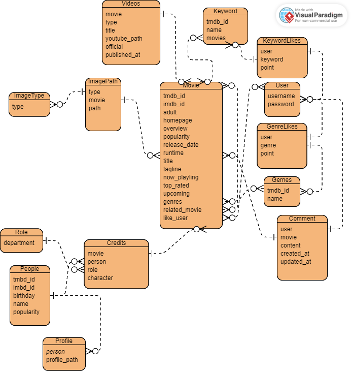

# MovieMate
사용자의 웹사이트 사용 패턴 분석을 활용한 영화 추천 사이트

### 프로젝트 진행기간
2023.11.16 ~ 2023.11.23

### 1. 팀원 정보 및 업무 분담 내역
1. 류승광
    * 회원가입, 로그인 백엔드 로직 및 프론트 구현
    * 프론트엔드 담당: Vuetify ver 3.4, Bootstrap ver 5.3 활용
    * 팀 로고 및 color palette, font, UI 구현

2. 황재언
    * Django를 활용한 서버 설계
    * 영화 데이터 베이스 설계 및 DB 모델 설계
    * IMDB API를 통한 DB 구축
    * 영화 추천 알고리즘 구현
    * API 설계 및 구현
    * 프론트엔드 자바스크립트, 컴포넌트 구성

### 2. 목표 서비스 구현 및 실제 구현 정도
  * 구현 목표
      1. 유저가 '좋아요'를 누른 영화의 'genre' 정보를 바탕으로 추천 영화를 띄워줌
      2. 추가적으로 타 OTT 사이트 레퍼런스로 참고하여 인기 있는 영화(popularity 값 내림차순으로 정렬)도 중간에 띄워줍니다.
      3. 영화 상세 페이지에서 장르, 배우로 이동할 수 있도록 해서 영화 API 정보에 들어있는 여러 가지 데이터를 연결하려고 했습니다.
      4. 검색창에서 검색 키워드에 일치하는 영화 제목을 검색 결과로 띄워주는 페이지 설계
    
  * 실제 구현 정도
      1. 유저가 좋아요 누른 영화의 'genre' 정보의 우선순위대로 영화를 한 row의 carousel 형식으로 구현했습니다.
      2. genre 별 영화 추천 row 사이에 인기도 순(popularity 값 내림차순), 최신 영화, 개봉 예정 영화를 추천해주어 유저 선택의 폭을 넓혔습니다.
      3. 영화 상세 페이지에서 장르, 배우, 영화 포스터, 유튜브 API를 통해 관련 영상 제공, 해당 영화 좋아요, 댓글을 남길 수 있는 기능을 구현했습니다.
      4. 검색 창에서 검색 결과에 일치하는 영화 뿐만 아니라 배우, 장르 정보까지 포함해서 결과를 다양하게 제공했습니다.
      5. 다크/라이트 모드를 변경할 수 있는 버튼을 넣었습니다.
        * 회원가입 시 유저가 좋아요를 누른 영화 장르를 기준으로 MovieMainView.vue 페이지에서
      유저가 좋아하는 영화를 장르별로 우선순위로 정렬해서 보여줍니다.

### 3. 데이터베이스 모델링(ERD)

### 4. 영화 추천 알고리즘에 대한 기술적 설명
  * 특정 영화에 '좋아요'를 누를 때마다 해당 영화의 장르 점수가 1점씩 올라갑니다.
  * 가장 점수가 높은 장르 2개에 해당하는 영화 20개를 랜덤으로 메인 페이지에서 보여줍니다.
  * 키워드 점수도 1점씩 올라가는 모델과 알고리즘까지 만들었지만 시간 부족으로 프론트에서 띄우지는 못 했습니다.
  * 메인 페이지에서 평점이 높은 영화(Top Rated Movies), 현재 상영 영화(Now Playing Movies), 상영 예정 영화(Upcoming Movies)를 보여줍니다.

### 5. 서비스 대표 기능에 대한 설명
  1. 로그인, 회원가입
      * 개인별 맞춤 서비스 제공을 위해 회원가입시 좋아하는 영화에 좋아요를 할 수 있는 기능을 구현했습니다.
  2. 메인페이지
      * 개인 맞춤 영화 추천 서비스를 제공 - 좋아요 누른 장르의 우선순위 정렬
      * 인기 있는 영화, 현재 상영 중인 영화, 상영 예정 영화 정보도 함께 띄워줘서 유저에게 다양한 정보를 알 수 있게 구현했습니다.
  3. 검색 기능
      * 검색기능을 통해 영화, 인물, 장르를 검색 가능하게 했습니다.
      * 해당 검색 결과에서 이미지가 없는 정보는 띄워지지 않게 추가적으로 설정했습니다.
  4. 배우 페이지
      * 해당 배우의 정보, 출연한 영화 중 데이터 베이스에 있는 영화 페이지로 이동할 수 있는 연결 링크 제공
  5. 장르 페이지
      * 해당 장르에 해당하는 영화를 추천해주는 페이지입니다.
  6. 다크/화이트 모드
      * 다크/화이트 모드로 변경할 수 있는 버튼을 넣었습니다.

### 6. 느낀점 & 후기
  1. 기획 단계
      * 타겟 고객의 Pain Point를 정의하고 해당 고객의 문제 해결을 위한 우선 순위를 정하고 일을 시작해서 의사결정이 원만하게 진행되었습니다.
      * Git, Notion을 활용해서 매일 2회의 스크럼 시간에 코드를 합치고 이슈 사항을 공유하는 소통의 시간을 가졌습니다.
      * 정해진 시간에 이슈를 공유하고 그 외에는 각자 맡은 페이지, 기능을 구현하는 데 초점을 맞췄습니다.
      * 각자 하는 업무의 현황을 공유하기 위해 Notion에서 Jira에서 쓰는 ticket 형식의 업무 처리 방식을 채택해서 활용해서 각자 맡은 부분에 대한 현황 파악이 용이해서 비대면으로 일할 때도 이슈 사항이 쉽게 의사소통이 되었습니다.
    

  2. 프론트엔드
      * 평소에 CSS, style을 크게 신경 쓸 겨를이 없다보니 이번 프로젝트를 통해 종합적인 프론트엔드 문제점에 봉착하고 해결해 가는 과정을 경험했습니다.
      * 통합된 스타일 시트 작성의 필요성을 절감했고, 코드의 재활용성에 대해, 그리고 클린 코드 작성의 필요성을 절감했습니다. (방학 시간을 활용해 집중적으로 공부해 볼 계획입니다)
      * color palette, font style 지정, 다크 모드 설정 등 소소한 포인트를 구현했던 것이 재밌었습니다.
      * grid를 조정하는 부분이 어려워서 반응형 웹을 구현하면서 사이즈에 따라 달라지는 요소들을 조정하는 것이 어려웠습니다.
      * 구현해보고 싶은 작은 요소들이 많았으나 우선순위에 집중하다 보니 많이 구현해보지 못했던 점이 아쉬웠습니다.

    
  3. 백엔드, DB
      * 프로젝트 초기 이틀을 DB 설계에 시간을 투입했는데 결과적으로 초기에 DB 모델을 꼼꼼하게 설계하는 것이 중요하다는 것을 깨달았습니다.
      * 데이터베이스 설계에 예상보다 시간이 오래 걸렸지만 프로젝트가 진행되면서 다양한 아이디어를 실험해보고 구현할 때 활용하는 것에 큰 도움이 되었습니다.
      * 유저에게 어떻게 영화를 추천해줄지 고민했고 DB를 보면서 다양한 방법을 실험할 수 있어서 좋았습니다.

    
  4. 기타
      * 회원 가입 과정에서 social login 기능을 구현해보고 싶었으나 시간이 부족해서 하지 못한 게 아쉬웠습니다.
      * 배포를 염두에 두고 aws로 서버를 구축했으나 도메인 주소가 주기적으로 바뀌어서 수동으로 업데이트를 해줘야 하는 이슈로 인해 aws 서버에서 구현하지 못한 점이 아쉬웠습니다.