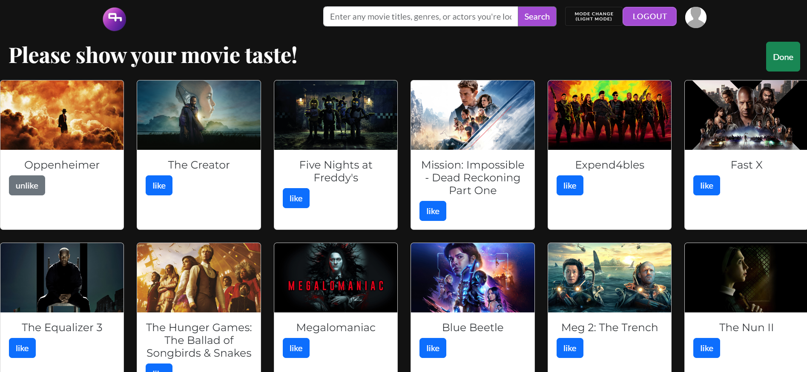

# :clapper: 영화 추천 서비스 MovieMate :movie_camera:


```
📢 SSFAY 10기 1학기 특화프로젝트
📢 주제 : 영화 추천
📢 서울1반
📢 23.11.16 ~ 23.11.23 (총 1주)
```
<br/>

---

# 🔍1. MovieMate 소개

### **💰어떤 영화를 봐야할 지 고민 중인 이용자를 위한 서비스**

        사용자의 웹사이트 사용 패턴 분석해,개인 맞춤으로 영화를 추천해주는 서비스

<br/>

# 🔍2. 개발 환경

## 2-1. 환경설정

### :computer: **Frontend**


### :cd: **Backend**


### 🤝 **Collaboration Tools**


<br/>

# 🔍3. 주요 기능

### - 로그인
  

### - 회원가입 후 영화 취향 선택
  

### - 영화 취향에 따른 영화 추천(장르 기반)
  

### - 영화 상세 정보 페이지
  

### - 영화별 댓글
  

### - 배우 상세 정보 페이지
  

### - 장르별 영화 페이지
  

### - 영화/인물/장르 검색
  

### - 마이페이지
  

<br/>
<br/>

# 🔍4. 산출물
## 4-1. ERD

## 4-2. Notion
https://www.notion.so/sgryu/Ticket-Box-f4bbc934189f4cc79f1f17ae89fe762d

<br/>

# 👩‍👦‍👦5. 팀 소개

|                   Frontend                    |                   Backend                    |
| :------------------------------------------: | :------------------------------------------: |
|  |  |
|                    류승광                    |                    황재언                    |